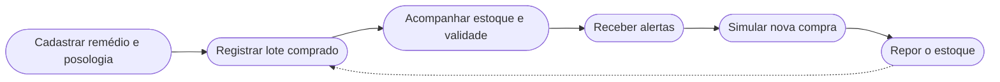
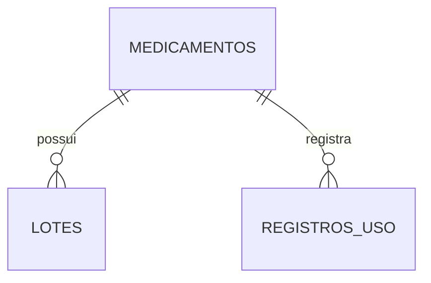

# 💊 MedStorage - Estoque, Validade e Compras de Medicamentos

> Sistema Web para controle pessoal de estoque de medicamentos: saiba o que você
> tem em casa, por quantos dias dura e se vale a pena comprar em promoção antes
> que o remédio vença.


-orange)


🔗 **Veja o sistema no ar:** [jftigre.github.io/medstorage](https://jftigre.github.io/medstorage/)

---

## Ideia, Objetivo Principal & Público-Alvo

- **Ideia & Objetivo:** Centralizar em um único painel o controle de estoque,
  validade e reposição dos medicamentos de uso contínuo, ajudando o usuário a
  comprar na hora certa e na quantidade certa.
- **Público-Alvo:**
  - **Pessoas em uso contínuo de medicamentos:** quem toma vários medicamentos
    todos os dias;
  - **Familiares e cuidadores:** quem ajuda a organizar a rotina de remédios.
- **Problema:** O controle costuma ser feito de cabeça, em caderno ou em
  planilha. Quem aproveita promoções e compra grandes quantidades de uma vez
  perde o controle de quanto tem, para quantos dias dura e se o remédio vai
  vencer antes de acabar. O resultado é remédio vencido, dinheiro desperdiçado e
  risco de ficar sem o medicamento.
- **Solução & Valor:** Interface Web simples e acessível (letras grandes, alto
  contraste) que calcula automaticamente quantos dias de estoque restam, alerta
  sobre validades e reposição e traz um simulador que responde: _"vale a pena
  comprar essa quantidade em promoção?"_

> ⚠️ **Aviso:** o MedStorage é uma ferramenta de organização de estoque. Ele
> **não** oferece orientação médica nem sugere doses. A posologia é informada
> pelo próprio usuário, conforme a prescrição do médico.

### Pilares do sistema

| Pilar | O que faz |
| ----- | --------- |
| 📦 **Estoque** | Cadastro de medicamentos com posologia, controle por lote (validade, quantidade, preço pago e local da compra), registro de uso e ajuste manual. |
| ⏳ **Validade** | Alertas de vencimento em 30, 60 e 90 dias e lista de lotes vencidos. |
| 🛒 **Reposição** | Cálculo de dias restantes e data de término do estoque, alerta de reposição e simulador "Vale a pena comprar?". |

### Fluxo principal de uso



### Regras de cálculo

1. O **consumo diário** é `comprimidos por dose × doses por dia`, informados pelo
   usuário conforme a prescrição.
2. Os **dias restantes** são `estoque total (soma dos lotes) ÷ consumo diário`, e
   a **data de término** é `hoje + dias restantes`.
3. O consumo segue a lógica **FEFO** (primeiro que vence, primeiro que sai): os
   lotes com validade mais próxima são usados antes.
4. Um lote entra em **alerta de validade** quando faltam 30, 60 ou 90 dias para
   vencer.
5. O **risco de desperdício** de um lote é a quantidade que sobrará na data de
   validade: `quantidade − consumo diário × dias até a validade`, quando o
   resultado for positivo.
6. O **alerta de reposição** é disparado quando os dias restantes ficam abaixo do
   estoque de segurança definido pelo usuário.
7. O **simulador** compara a quantidade da promoção com o consumo até a validade
   e estima quantas unidades serão usadas, quantas sobrarão vencidas e a
   economia líquida da compra.

---

## Benchmarking (Análise Comparativa)

<!-- TODO: validar as funcionalidades de cada ferramenta e anexar os prints no pitch -->

| Ferramenta | Pontos Fortes | Limitações | Diferencial da Solução |
| ---------- | ------------- | ---------- | ---------------------- |
| Medisafe | Lembretes de horário de doses | Foco em lembretes, não em compras e validade de lotes | Controle de estoque por lote e simulador de compra em promoção |
| MyTherapy | Agenda de medicação e acompanhamento | Foco em adesão ao tratamento, pouco foco em gestão de compras | Previsão de término do estoque e alerta de desperdício |
| Consulta Remédios | Comparação de preços entre farmácias | Não controla o estoque pessoal do usuário | Une preço pago, estoque e validade em um só lugar |
| Planilha / caderno | Flexível e gratuito | Manual, sem alertas e sem cálculos automáticos | Cálculos e alertas automáticos, com interface acessível |

---

## Equipe

- **[Nome]** - [Matrícula] | [GitHub]() | [LinkedIn]()
- **[Nome]** - [Matrícula] | [GitHub]() | [LinkedIn]()
- **[Nome]** - [Matrícula] | [GitHub]() | [LinkedIn]()

---

## Documentação & Recursos

- **Pitch / Apresentação:** [Link dos slides da proposta]()
- **Protótipos / Design:** [Ver protótipos](docs/prototypes/) | [Google Stitch]()
- **Workflow / Kanban:** [GitHub Projects](https://github.com/users/jftigre/projects/2)
- **Documentação do Projeto:** [Ver pasta de documentação](docs/)
  - [Modelo de dados](docs/data-model.md)
  - [Regras de cálculo e simulador](docs/business-rules.md)

---

## Páginas / Telas da Aplicação (GitHub Pages)

**Índice**

- 🏠 **Índice / Home:** [https://jftigre.github.io/medstorage/](https://jftigre.github.io/medstorage/)

**Acesso**

- 🔑 **Login:** [login.html](https://jftigre.github.io/medstorage/login.html)

**Painel**

- 📊 **Dashboard:** [dashboard.html](https://jftigre.github.io/medstorage/dashboard.html)

**Estoque**

- 💊 **Meus Remédios:** [medicamentos.html](https://jftigre.github.io/medstorage/medicamentos.html)
- ➕ **Cadastro / Edição de Remédio:** [medicamento-form.html](https://jftigre.github.io/medstorage/medicamento-form.html)

**Compras e Alertas**

- 🛒 **Simulador de Compra:** [simulador.html](https://jftigre.github.io/medstorage/simulador.html)
- 🔔 **Alertas (Validade e Reposição):** [alertas.html](https://jftigre.github.io/medstorage/alertas.html)

> Nesta etapa as telas são **estáticas, com dados fictícios** (HTML + CSS).
> Nada é gravado e não há login real.

---

## Funcionalidades Planejadas (Features)

### Etapa inicial (interface estática com dados fictícios)

- [ ] Telas estáticas (HTML + CSS com Tailwind)
- [ ] Página `index.html` com links para todas as telas
- [ ] Telas responsivas (celular e computador)
- [ ] Identidade visual (nome, logo e paleta em teal, com status em verde, âmbar e vermelho)
- [ ] Acessibilidade (fonte grande, alto contraste e botões amplos)
- [ ] Badges de status padronizados (cor, ícone e texto) em todas as telas

### Projeto 1.1 (Front-end Vanilla)

- [ ] Listagem de remédios com busca e filtro por situação: estoque baixo, vencendo e vencido (`filter`)
- [ ] CRUD de medicamentos com posologia (arrays e LocalStorage ou `json-server`)
- [ ] Cadastro de lotes com validade, quantidade, preço pago, local e marcação de promoção
- [ ] Registro de uso e ajuste manual do estoque
- [ ] Cálculo de consumo diário, dias restantes e data de término (`map` e `reduce`)
- [ ] Alertas de validade (30, 60 e 90 dias) e de reposição (`filter`)
- [ ] Simulador "Vale a pena comprar?" com economia e risco de desperdício
- [ ] Dashboard com resumo do estoque e previsão de reposição (`reduce`)
- [ ] Organização modular com ESM e uso do Vite (template vanilla)

### Projeto 1.2 (Next.js, React e Supabase)

- [ ] Autenticação (login, cadastro e logout) com Supabase Auth
- [ ] Proteção de rotas para usuários autenticados
- [ ] Persistência de medicamentos, lotes e registros de uso no PostgreSQL (Supabase)
- [ ] Políticas de Row Level Security para que cada usuário veja apenas o próprio estoque
- [ ] Formulários validados com React Hook Form e Zod (medicamento, posologia e lote)
- [ ] Gerência de estado com Context API ou Zustand e TanStack Query (dados do servidor)

### Fora do escopo inicial (possíveis evoluções)

- Controle de medicamentos controlados e integração com receitas
- Orientação médica ou sugestão de doses
- Lembretes de horário das doses e notificações
- Leitura de código de barras da embalagem
- Importação em lote do estoque via arquivo CSV

---

## Estratégia para Obtenção de Dados Reais (Hipóteses Técnicas)

- **Fontes de Dados & Coleta:**
  - Cadastro feito pelo próprio usuário (medicamentos, posologia e lotes com
    validade e preço pago), que é a fonte principal, já que o estoque é pessoal;
  - Catálogo de medicamentos a partir de dados abertos da **ANVISA** (nome,
    princípio ativo e apresentação) para autocompletar o cadastro _(verificar
    formato e disponibilidade)_;
  - Tabela **CMED** de preço máximo ao consumidor como referência para avaliar se
    a promoção é vantajosa _(verificar formato e disponibilidade)_.
- **Armazenamento & API:**
  - Tabelas modeladas no **Supabase PostgreSQL** (modelo abaixo);
  - Autenticação com **Supabase Auth**;
  - **Row Level Security (RLS)** para que cada pessoa veja apenas o próprio
    estoque;
  - Regras de cálculo (consumo, validade e simulador) em **funções puras**,
    reaproveitadas do Projeto 1.1 no Projeto 1.2.

### Do dado fictício ao dado real

| O que a tela mostra hoje (fictício) | De onde virá o dado real | Quando |
| ----------------------------------- | ------------------------ | ------ |
| Medicamentos e posologia | Cadastro feito pelo usuário (CRUD) | 1.1: LocalStorage ou `json-server`; 1.2: tabela `medicamentos` |
| Lotes, validades e preços pagos | Registro do usuário a cada compra | 1.1: LocalStorage; 1.2: tabela `lotes` |
| Nomes e apresentações dos remédios | Dados abertos da ANVISA, para autocompletar | Evolução (a verificar) |
| Preço de referência | Tabela CMED | Evolução (a verificar) |
| Estoque atual e dias restantes | Soma dos lotes ÷ consumo diário (`reduce`) | 1.1 e 1.2 |
| Alertas de validade e reposição | Cálculo sobre lotes e consumo (`filter`) | 1.1 e 1.2 |
| Resultado do simulador | Função de cálculo em `utils/` | 1.1 e 1.2 |
| Resumo do dashboard | Agregação de medicamentos e lotes (`reduce`) | 1.1 e 1.2 |
| Login e usuário | Cadastro real de usuários | 1.2: Supabase Auth |

### Modelo de dados inicial

| Tabela | Principais campos |
| ------ | ----------------- |
| `medicamentos` | id, usuario_id, nome, dosagem, forma, comprimidos_por_dose, doses_por_dia, estoque_minimo_dias |
| `lotes` | id, medicamento_id, validade, quantidade, preco_pago, local_compra, em_promocao |
| `registros_uso` | id, medicamento_id, data, quantidade, tipo (`uso` ou `ajuste`) |

<details>
<summary>🗺️ Ver o diagrama de relacionamento das tabelas</summary>



</details>

---

## Tecnologias

- **Etapa inicial:** HTML5, CSS3 e Tailwind CSS
- **Projeto 1.1:** JavaScript (ESM), Vite (template vanilla), LocalStorage ou `json-server`
- **Projeto 1.2:** Next.js (App Router), TypeScript, React, Tailwind CSS, Supabase, React Hook Form, Zod, Zustand ou Context API, TanStack Query

### Como cada critério da disciplina será atendido

<details>
<summary>📌 Projeto 1.1 (Vanilla)</summary>

| Critério | Onde aparece no MedStorage |
| -------- | -------------------------- |
| Programação funcional | `filter` na busca, nos filtros por situação e nos alertas; `map` para montar as listas e os cards; `reduce` no estoque total, nos dias restantes e no resumo do dashboard |
| ESM | Todo o `src/` com `import` e `export`, separado em `pages/`, `components/`, `services/` e `utils/` (regras de cálculo em funções puras) |
| Estruturação de dados | Medicamentos, lotes e registros de uso em arrays de objetos, persistidos no LocalStorage ou `json-server` |
| DOM e componentes dinâmicos | Cards de remédio, badges de status e linhas de lote criados com `createElement` e `appendChild`, mais o CRUD de medicamentos |
| Eventos | Cliques (editar, excluir, registrar uso), envio de formulários, campos de busca e filtro e atualização do simulador ao digitar |
| Vite | Projeto criado a partir do template vanilla, em `vanilla/` |

</details>

<details>
<summary>📌 Projeto 1.2 (React + Supabase)</summary>

| Critério | Onde aparece no MedStorage |
| -------- | -------------------------- |
| Arquitetura | Next.js (App Router) e TypeScript, com pastas separadas por responsabilidade (`app/`, `components/`, `hooks/`, `services/` e `schemas/`) |
| Supabase | Login, cadastro, logout, proteção de rotas e CRUD no PostgreSQL, com RLS por usuário |
| Componentes e UI | Componentes reutilizáveis com Tailwind CSS, layout responsivo e acessível |
| Formulários | React Hook Form + Zod, com validação de validade, quantidade, preço e posologia e mensagens de erro |
| Estado | `useState`, Context API ou Zustand (sessão e filtros) e TanStack Query (dados do servidor) |

</details>

---

## Estrutura do Repositório

Um único repositório com uma pasta por etapa. Cada pasta é independente.

<details>
<summary>📁 Ver a estrutura de pastas</summary>

```text
medstorage/
├── index.html              índice de links das telas estáticas
├── login.html              ETAPA INICIAL (HTML + CSS):
├── dashboard.html          telas estáticas na raiz
├── medicamentos.html
├── medicamento-form.html
├── simulador.html
├── alertas.html
├── assets/                 css e imagens
├── README.md
├── preview.png             print 16:9, até 500 KB
├── .github/                modelos de issue e de pull request
├── docs/
│   ├── prototypes/         prints do Google Stitch e logo
│   ├── data-model.md       tabelas do Supabase
│   └── business-rules.md   regras de cálculo e do simulador
├── vanilla/                PROJETO 1.1 (Vite + JavaScript puro)
└── web/                    PROJETO 1.2 (Next.js + Supabase)
```

</details>

---

## Como executar

> Esta seção será atualizada a cada etapa, com instruções de instalação,
> configuração (`.env.example`) e execução.

```bash
git clone https://github.com/jftigre/medstorage.git
cd medstorage
```

**Etapa inicial (telas estáticas):** abra o `index.html` no navegador ou acesse
a versão publicada no [GitHub Pages](https://jftigre.github.io/medstorage/).

**Projeto 1.1 (`vanilla/`):** instruções de instalação e execução serão
adicionadas ao concluir a etapa.

**Projeto 1.2 (`web/`):** instruções de instalação, variáveis de ambiente
(`.env.example`) e execução serão adicionadas ao concluir a etapa.

---

## Fluxo de Trabalho

- Uma **issue por história de usuário**, com critérios de aceitação em checklist
  (exemplo: *Como usuário, quero simular uma compra em promoção para saber se vou
  usar tudo antes da validade*).
- Labels por **pilar** (estoque, validade e reposição) e por **etapa**
  (inicial, 1.1, 1.2).
- Quadro Kanban no GitHub Projects: Backlog, Em andamento, Em revisão e
  Concluído.
- Todo commit ou pull request cita a issue (`closes #N`), registrando a
  participação de cada integrante.

---

## Licença

<!-- Definir a licença do projeto e adicionar o arquivo LICENSE -->